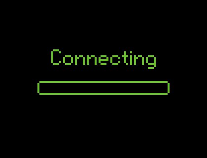

  

#

  I'm a student passionate about technology, software development and cybersecurity.
    
  Currently focused on improving my skills in web development, programming and building real-world projects.
   
  I'm constantly learning new technologies and creating projects to grow as a developer.

#

<h3 align="left">Connect with me!</h3>

#

<h3 align="left">My Stack ~</h3>

  
  

  
  

  
  

  
  

  
  

  
  

  
  

  

#

  <h3>* GitHub Stats *</h3>

   

  

  

#

<picture align="center">
  <source media="(prefers-color-scheme: dark)" srcset="https://raw.githubusercontent.com/camposss00/camposss00/output/github-contribution-grid-snake-dark.svg">
  <source media="(prefers-color-scheme: light)" srcset="https://raw.githubusercontent.com/camposss00/camposss00/output/github-contribution-grid-snake-dark.svg">
  
</picture>
